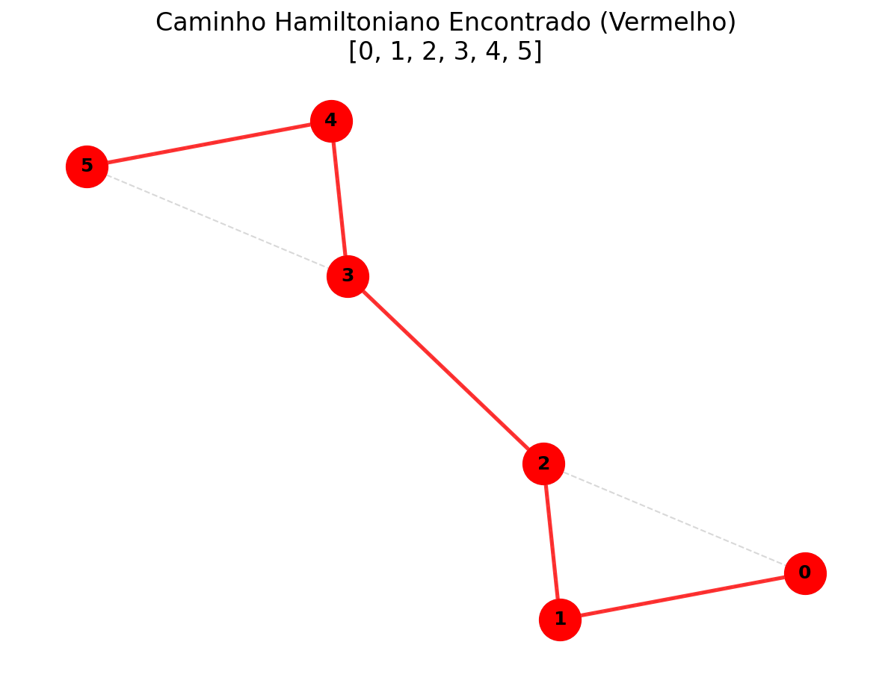

# Implementação do Algoritmo de Caminho Hamiltoniano (Backtracking) em Python 🛤️

**Trabalho Individual 3 - Fundamentos de Projeto e Análise de Algoritmos**

Este projeto apresenta uma implementação em Python do algoritmo de **Backtracking** para encontrar um **Caminho Hamiltoniano** em um grafo. Um Caminho Hamiltoniano é um caminho que visita cada vértice do grafo exatamente uma vez[cite: 1177].

Encontrar tal caminho é um problema NP-Completo clássico, intimamente relacionado ao Problema do Caixeiro Viajante (TSP)[cite: 1178]. A abordagem de backtracking implementada explora sistematicamente todas as possibilidades de caminhos, "retrocedendo" assim que um caminho se mostra inviável.

---

## 📜 Descrição do Projeto

O algoritmo implementado utiliza uma classe `Grafo` que armazena os vértices e arestas usando uma lista de adjacência. A lógica principal de busca é encapsulada em uma função recursiva de backtracking (`_backtrack_util`) que tenta construir um caminho passo a passo.

### 🧠 Lógica do Algoritmo (main.py)

A lógica para encontrar o caminho em um grafo `G` com `V` vértices é a seguinte:

1.  **Função Principal (`encontrar_caminho_hamiltoniano`)**:
    Como o caminho pode começar em qualquer vértice, esta função itera por todos os vértices (de `0` a `V-1`), usando cada um como um ponto de partida potencial.

    ```python
    def encontrar_caminho_hamiltoniano(self):
        for inicio in range(self.V):
            # Prepara estruturas para uma nova busca
            self.path = []
            visitado = [False] * self.V
            
            # Chama a função recursiva de backtracking
            if self._backtrack_util(inicio, visitado):
                return self.path # Sucesso
        
        return None # Falha
    ```

2.  **Função Recursiva (`_backtrack_util`) - Escolha**:
    No início da função, o vértice atual `v` é "escolhido": ele é adicionado ao `self.path` e marcado como `visitado`.

    ```python
    def _backtrack_util(self, v, visitado):
        self.path.append(v)
        visitado[v] = True
    ```

3.  **Função Recursiva - Caso Base (Sucesso)**:
    A recursão para se o comprimento do caminho for igual ao número de vértices no grafo. Isso significa que todos os vértices foram visitados, e um caminho Hamiltoniano foi encontrado.

    ```python
        if len(self.path) == self.V:
            return True
    ```

4.  **Função Recursiva - Exploração**:
    O algoritmo itera por todos os `vizinhos` do vértice `v`. Se um vizinho ainda não foi `visitado`, ele faz uma chamada recursiva para explorar esse vizinho. Se essa chamada recursiva retornar `True`, o sucesso é propagado para cima.

    ```python
        for vizinho in self.adj[v]:
            if not visitado[vizinho]:
                if self._backtrack_util(vizinho, visitado):
                    return True
    ```

5.  **Função Recursiva - Backtrack (Falha)**:
    Se o loop de vizinhos terminar sem encontrar um caminho (ou seja, todas as chamadas recursivas retornaram `False`), significa que a "escolha" de `v` neste ponto foi um beco sem saída. O algoritmo retrocede, desfazendo a escolha.

    ```python
        # Backtrack
        self.path.pop()
        visitado[v] = False
        return False
    ```

---

## ⚙️ Como Executar o Projeto

Para executar o código em seu ambiente local, siga as instruções abaixo:

1.  **Clone o repositório (exemplo):**
    ```bash
    git clone https://github.com/JoaoYM/fundamentos_projeto_analise_algoritmos.git
    cd seu-repositorio
    ```

2.  **Execute o arquivo principal:**
    O `main.py` não possui dependências externas.
    ```bash
    python main.py
    ```
    O terminal exibirá a saída dos exemplos, indicando se um caminho foi encontrado e qual é o caminho.

3.  **(Opcional) Execute a visualização (Ponto Extra):**
    Esta funcionalidade (arquivo `view.py`) requer as bibliotecas `networkx` e `matplotlib`.

    * **Instale as dependências:**
        ```bash
        pip install networkx matplotlib
        ```

    * **Execute o script de visualização:**
        ```bash
        python view.py
        ```
    * Isso executará o algoritmo e, em seguida, abrirá uma janela do `matplotlib` mostrando o grafo. O caminho encontrado será destacado em vermelho. Uma imagem (`caminho_hamiltoniano.png`) também será salva na pasta `assets/`.

---

## 📊 Relatório Técnico

### Análise da Complexidade Computacional (Classes P, NP, NP-Completo e NP-Difícil)

**Referência:** AULA 02_Introdução à teoria da complexidade.pdf - Páginas 69-95

O Problema do Caminho Hamiltoniano (HPP) é um problema de decisão fundamental na teoria da computação. Sua classificação é a seguinte:

* **Classe P (Polinomial)**:
    * **Definição:** Problemas que podem ser *resolvidos* por um algoritmo determinístico em tempo polinomial ($O(n^k)$)[cite: 845, 847].
    * **Classificação HPP:** O HPP **não pertence** à classe P (assumindo a crença geral de que $P \ne NP$). Não existe um algoritmo conhecido que resolva o HPP em tempo polinomial.

* **Classe NP (Não-Determinístico Polinomial)**:
    * **Definição:** Problemas cujas soluções ("certificados") podem ser *verificadas* em tempo polinomial por um algoritmo determinístico[cite: 859, 861].
    * **Classificação HPP:** O HPP **pertence** à classe NP. Se recebermos um caminho candidato (uma sequência de $V$ vértices), podemos verificá-lo em tempo polinomial:
        1.  Checar se o caminho contém $V$ vértices únicos ($O(V)$).
        2.  Checar se existe uma aresta entre cada vértice $v_i$ e $v_{i+1}$ no caminho ( $O(V)$ ).
    * Como a verificação é polinomial, o problema está em NP.

* **Classe NP-Difícil (NP-Hard)**:
    * **Definição:** Problemas que são *pelo menos tão difíceis* quanto qualquer problema em NP[cite: 898]. Todo problema NP pode ser reduzido a um problema NP-Difícil em tempo polinomial[cite: 898, 929].
    * **Classificação HPP:** O HPP **é NP-Difícil**.

* **Classe NP-Completo (NP-Complete)**:
    * **Definição:** Problemas que atendem a duas condições: 1) Pertencem a NP e 2) São NP-Difíceis[cite: 882, 884, 885].
    * **Classificação HPP:** O HPP **é NP-Completo**[cite: 940, 1015]. Ele está em NP (é verificável) e é NP-Difícil (tão difícil quanto qualquer problema NP).

**Justificativa (Relação com o TSP):**
O Problema do Caixeiro Viajante (TSP) [cite: 1028], em sua versão de decisão ("existe um ciclo de custo $\le k$?"), é NP-Completo[cite: 1016]. O Problema do Caminho Hamiltoniano pode ser reduzido ao TSP. Se pudéssemos resolver o HPP em tempo polinomial, poderíamos também resolver o TSP e, por extensão, todos os problemas NP-Completos. Isso solidifica sua classificação como NP-Completo.

### Análise da Complexidade Assintótica de Tempo

* **Método Utilizado:** A complexidade é determinada pela **análise da árvore de recursão (contagem de operações)**, similar à análise de força bruta do TSP[cite: 1100, 1101, 1116]. O Teorema Mestre não se aplica, como detalhado abaixo.
* **Análise:** No pior caso, a função `_backtrack_util` será chamada para cada caminho possível.
    * O primeiro vértice (escolhido na função principal) tem $V$ opções.
    * O segundo vértice (primeira chamada recursiva) tem até $(V-1)$ vizinhos para explorar.
    * O terceiro vértice tem até $(V-2)$ vizinhos, e assim por diante.
* **Relação de Recorrência (informal):** $T(n) = n \cdot T(n-1)$, onde $n$ é o número de vértices a visitar.
* **Complexidade:** O número total de caminhos explorados na árvore de recursão é da ordem de $V!$ (V fatorial). Como a função principal pode iniciar a busca de $V$ vértices diferentes, a complexidade de tempo total do algoritmo é **$O(V \cdot V!)$**. Esta é uma complexidade fatorial, que cresce mais rápido que a exponencial (ex: $O(2^n)$) e é considerada intratável para grafos que não sejam muito pequenos.

### Aplicação do Teorema Mestre

**Referência:** AULA 02_Introdução à teoria da complexidade.pdf - Páginas 199-212, 414-416

**Não é possível aplicar o Teorema Mestre** ao algoritmo de backtracking implementado.

**Justificativa:**
O Teorema Mestre foi projetado para resolver recorrências de **divisão e conquista**, que seguem o formato estrito:
$T(n) = a \cdot T(n/b) + f(n)$ [cite: 205]

O Teorema Mestre exige que o problema seja dividido em subproblemas de tamanho *proporcional* (ex: $n/b$)[cite: 212, 415, 541].

Nosso algoritmo de backtracking usa uma abordagem *subtrativa*. A cada chamada recursiva, o "tamanho" do problema (o número de vértices restantes a visitar) é reduzido em 1. A recorrência se assemelha a $T(n) \approx n \cdot T(n-1)$, que não se encaixa no formato $T(n/b)$.

Conforme visto na aula, algoritmos com recorrências baseadas em decrementos lineares (como $T(n-1)$) não podem ser analisados pelo Teorema Mestre e exigem outros métodos, como a expansão de recorrência[cite: 199, 212, 260, 416].

### Análise dos Casos de Complexidade (Pior, Médio, Melhor)

**Referência:** AULA 02_Introdução à teoria da complexidade.pdf - Páginas 406-410, 532-536, 1132-1135

* **Pior Caso:**
    * **Descrição:** Ocorre quando o algoritmo precisa explorar o maior número possível de caminhos parciais. Isso acontece se:
        1.  O grafo **não** possui Caminho Hamiltoniano. O algoritmo deve explorar todas as $V!$ permutações (a partir de todas as $V$ origens) para provar que nenhuma funciona.
        2.  O grafo possui um caminho, mas ele é o último a ser encontrado (ex: começa no último vértice `inicio` testado, e os vizinhos corretos são sempre os últimos na lista de adjacência).
    * **Complexidade:** $O(V \cdot V!)$ [cite: 1132-1134].

* **Melhor Caso:**
    * **Descrição:** Ocorre quando o algoritmo encontra o caminho na primeira tentativa, sem retroceder (backtracking).
    * **Exemplo:** O algoritmo inicia a busca no vértice `0` (primeira iteração da função principal). O primeiro vizinho de `0` é `1`, o primeiro vizinho de `1` (não visitado) é `2`, e assim por diante, formando um caminho `0-1-2-...-(V-1)` que é Hamiltoniano.
    * **Complexidade:** $O(V)$. O algoritmo faz apenas $V$ chamadas recursivas (uma para cada vértice no caminho) e termina[cite: 1135].

* **Caso Médio:**
    * **Descrição:** O desempenho médio depende muito da estrutura (densidade) do grafo. Em grafos esparsos, os caminhos são "podados" (backtrack) rapidamente, pois os vértices têm poucos vizinhos. Em grafos densos, mais caminhos precisam ser explorados.
    * **Complexidade:** Apesar de "podar" a árvore de busca, o número de caminhos a explorar em um grafo aleatório médio ainda é exponencial/fatorial. A complexidade do caso médio ainda é intratável e muito mais próxima do Pior Caso do que do Melhor Caso.

---

## 🎨 Visualização (Opcional)

A execução do script `view.py` (requer `networkx` e `matplotlib`) gera uma visualização do grafo e salva em `assets/caminho_hamiltoniano.png`. O caminho encontrado é destacado em vermelho.


*(Esta imagem é um placeholder. Execute view.py para gerar a sua.)*

---

## 🔍 Conclusões Técnicas

1.  **Classificação Comprovada**: O Problema do Caminho Hamiltoniano é um exemplo clássico de um problema **NP-Completo**. Embora sua solução seja *difícil de encontrar* (requer tempo fatorial $O(V!)$ com backtracking), ela é *fácil de verificar* (em tempo linear $O(V)$), colocando-o firmemente na classe NP[cite: 859, 940, 1015].
2.  **Limites do Teorema Mestre**: A análise deste algoritmo demonstra um limite chave do Teorema Mestre. Ele não é aplicável a algoritmos recursivos que reduzem o problema de forma subtrativa (ex: $T(n-1)$), sendo necessário usar métodos como expansão de recorrência ou análise da árvore de recursão[cite: 260, 415, 541].
3.  **O Custo do Backtracking**: A implementação demonstra o poder e o custo do backtracking. Embora encontre a solução correta, seu desempenho no pior caso ($O(V!)$) [cite: 1134] o torna inviável para grafos de tamanho moderado, justificando por que problemas NP-Completos são considerados "intratáveis" na prática.
4.  **Variação de Desempenho**: O algoritmo tem uma diferença drástica entre o melhor caso ($O(V)$) [cite: 1135] e o pior caso ($O(V!)$)[cite: 1134], destacando como a estrutura específica da entrada pode impactar drasticamente o tempo de execução.

---

## 📚 Referências

* **AULA 02_Introdução à teoria da complexidade.pdf** (Material da disciplina)
* CORMEN, T. H. et al. *Algoritmos: Teoria e Prática*. 3.ed. São Paulo: GEN LTC, 2012[cite: 1139].
* ZIVIANI, Nivio. *Projeto de algoritmos: com implementações em Java e C++*. São Paulo: Cengage Learning, c2007[cite: 1144].
* Repositório do Professor: `https://github.com/joaopauloaramuni/fundamentos-de-projeto-e-analise-de-algoritmos` [cite: 1186]

---

### Extra: Diagrama Visual do Algoritmo (Exemplo de Rastreamento)

**Objetivo:** Ilustrar o processo de backtracking para encontrar o caminho no Grafo `g3` (completo, $V=4$) do `main.py`.

**Grafo (Completo, K4):**
* Vértices: {0, 1, 2, 3}
* Arestas: (0,1), (0,2), (0,3), (1,2), (1,3), (2,3)

**Tentativa 1: Iniciar no vértice 0**

* `encontrar_caminho_hamiltoniano()` chama `_backtrack_util(v=0, visitado=[F,F,F,F])`
    * `path = [0]`, `visitado = [T,F,F,F]`
    * Caso base `len(path) == 4`? Não (1 != 4).
    * **Explorar vizinhos de 0**: `[1, 2, 3]`
        * **Tentar vizinho 1**: `visitado[1]` é False? Sim.
        * Chamar `_backtrack_util(v=1, visitado=[T,F,F,F])`
            * `path = [0, 1]`, `visitado = [T,T,F,F]`
            * Caso base `len(path) == 4`? Não (2 != 4).
            * **Explorar vizinhos de 1**: `[0, 2, 3]`
                * **Tentar vizinho 0**: `visitado[0]` é False? Não (é True).
                * **Tentar vizinho 2**: `visitado[2]` é False? Sim.
                * Chamar `_backtrack_util(v=2, visitado=[T,T,F,F])`
                    * `path = [0, 1, 2]`, `visitado = [T,T,T,F]`
                    * Caso base `len(path) == 4`? Não (3 != 4).
                    * **Explorar vizinhos de 2**: `[0, 1, 3]`
                        * **Tentar vizinho 0**: `visitado[0]` é False? Não.
                        * **Tentar vizinho 1**: `visitado[1]` é False? Não.
                        * **Tentar vizinho 3**: `visitado[3]` é False? Sim.
                        * Chamar `_backtrack_util(v=3, visitado=[T,T,T,F])`
                            * `path = [0, 1, 2, 3]`, `visitado = [T,T,T,T]`
                            * **Caso base `len(path) == 4`? Sim.**
                            * **Retorna `True`**
                        * Chamada recursiva (v=3) retornou `True`. Retorna `True`.
                    * Chamada recursiva (v=2) retornou `True`. Retorna `True`.
                * Chamada recursiva (v=1) retornou `True`. Retorna `True`.
            * Chamada recursiva (v=0) retornou `True`.
* `encontrar_caminho_hamiltoniano()` recebe `True`.
* **Resultado Final:** Retorna `path = [0, 1, 2, 3]` (Este é o Melhor Caso, $O(V)$).